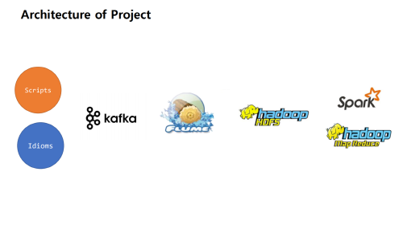
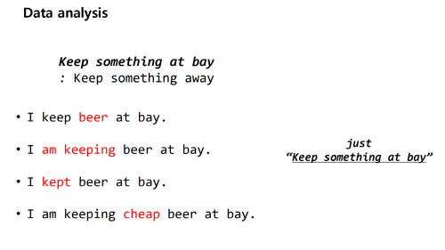
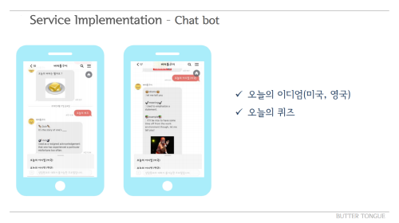

# butter-tongue
 
<경기도 빅데이터 전문가 기술 과정 팀 프로젝트>
 
미드, 영드 및 영미권 영화들의 scripts를 분석하여,
 
국가 별로 가장 많이 쓰이는 표현을 DB로 구축
  
구축된 DB를 이용하여 사용자들이 영어 학습을 효율적으로 할 수 있도록
 
오늘의 이디엄, 오늘의 퀴즈 등의 기능을 구현하였습니다.
   

------

 

## Data Crawling
- 영화 제목 따옴 from Springfield
- 영화 제목 IMDB 검색 통해 국가별 분류(미국 / 영국)
- 영미권 아닌 영화들은 사용 불가하기 때문에 폐기
 

## Storage Modeling

- 영미권으로 분류된 영화만 url 통해 script 저장
- script를 txt 파일로 변환해 Kafka로 보냄 
- Kafka -> Flume Agent 통해 HDFS에 저장
 

## Refine script
- 스크립트 앞에 위치한 개행 및 공백 제거
- 문장 대사 간 구분 쉽게 '. '를 '.₩n' 으로 변경 -> 개행
 

## Count idioms

- 노이즈 처리(동사, 목적어 등)
    - 시제 변화 처리
    - someone, something 등의 목적어 처리
- Oxford dict. crawling 통해 미리 만들어 놓은 Idiom list 돌며 등장 횟수 카운팅
 

## 신뢰도 검증 및 서비스 구현
- 미리 남겨놓은 validation set 돌며 신뢰도 검증
 

## Implements service

- Kakao 플러스 친구 API를 사용하여 플러스 친구 어플리케이션 구현
- Python과 Django를 이용한 어플리케이션
 

------

 

*2018년 10월,  
django 2.0 이하 버전에서 보안 문제가 발생하였기 때문에 
해당 프로젝트를 참조하시는 분들은 참고해주시길 바랍니다.*

